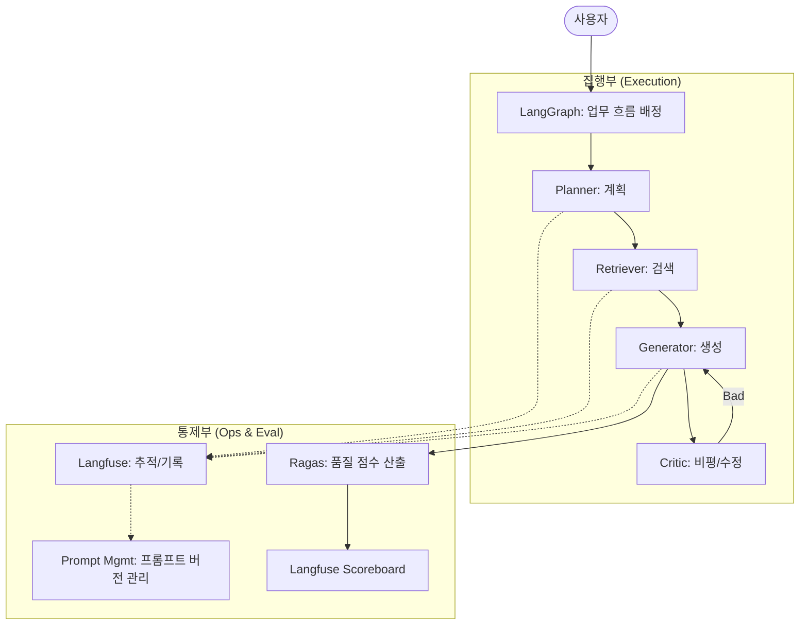

# Enterprise Agentic RAG Architecture
## 실험실을 넘어 실서비스급 RAG 플랫폼으로의 도약

본 문서는 LangChain, LangGraph, Langfuse, Ragas가 각각 **왜(Why)** 사용되었고, 우리 시스템에서 **어떻게(How)** 구현되어 있는지를 기술적으로 상세히 설명합니다.

---

## 1. LangChain: 거대한 생태계의 표준 인터페이스 (Foundation)

### 💡 Why LangChain?
- **표준화(Standardization)**: 각기 다른 LLM 공급자(OpenAI, Anthropic, Ollama 등)의 입출력 형식을 `HumanMessage`, `AIMessage` 등으로 통일하여 코드의 범용성을 확보합니다.
- **풍부한 유틸리티**: 문서 파싱, 텍스트 분할(`RecursiveCharacterTextSplitter`), 벡터 저장소 인터페이스 등 RAG 구축에 필요한 검증된 부품(Components)을 제공합니다.
- **확장성**: LangGraph, Ragas 등 현대적인 AI 라이브러리들이 LangChain의 데이터 구조를 기반으로 설계되어 있어 결합이 용이합니다.

---

## 2. LangGraph: 에이전틱 사고의 뇌 (Orchestration)

### 🧩 How we use LangGraph?
우리 시스템의 `Advanced Agent`는 LangGraph의 **StateGraph**를 통해 복잡한 사고 루프를 제어합니다.

- **Stateful Workflow**: `TypedDict`를 상속받은 `AdvancedAgentState`가 전체 그래프를 흐르며 검색된 문서(Context), 비평 점수(Critique Score), 재시도 횟수(Retry Count)를 관리합니다.
- **Node-based Logic**: 
    - `planner`: 질문을 분석하여 실행 계획(Plan) 수립.
    - `executor`: 검색(Retriever)과 답변 생성 수행.
    - `critic`: 생성된 답변이 Context와 일치하는지 자가 검토.
- **Conditional Routing**: `critic` 노드 이후 점수가 0.8점 미만일 경우 `executor`로 화살표를 되돌려 답변을 수정하게 하는 **순환(Cycle) 로직**을 구현하고 있습니다.

---

## 3. Langfuse: 시스템의 눈과 기억 (Observability / PromptOps)

### 🔍 How we use Langfuse?
단순한 로그를 넘어, 우리 시스템은 `monitor.py`와 `prompts.py`를 통해 실시간 통제권을 확보합니다.

- **Tracing (자동 추적)**: `@observable` 데코레이터를 사용하여 각 노드(planner, executor 등)의 입력, 출력, 소요 시간, 모델 파라미터를 자동으로 Langfuse 서버로 전송합니다. 이를 통해 "답변이 왜 늦어지는지", "어디에서 할루시네이션이 시작되었는지" 시각적으로 분석합니다.
- **PromptOps (실시간 통제)**: `PromptManager`는 Langfuse 클라우드에 등록된 프롬프트를 원격으로 가져옵니다. 팀원들은 Python 코드를 한 줄도 고치지 않고 **Langfuse UI에서 프롬프트를 수정하고 바로 서비스에 반영**할 수 있습니다. (배포 없는 운영)

---

## 4. Ragas: 품질의 잣대 (Standardized Evaluation)

### ⚖️ How we use Ragas?
우리는 `evaluator.py`에서 Ragas를 사용하여 주관적인 답변 품질을 객관적인 수치로 환산합니다.

- **Dataset-driven Batch Eval**: 평가용 질문 세트(Golden Set)를 `Dataset` 객체로 변환한 뒤, Ragas의 `evaluate` 함수를 호출하여 **Faithfulness(충실도)**와 **Answer Relevancy(관련성)** 점수를 한 번에 산출합니다.
- **LLM-as-Judge**: 사람이 직접 채점하는 대신, `LangchainLLMWrapper`로 감싼 GPT-4o 모델이 채점관 역할을 수행합니다.
- **Score Injection**: 산출된 Ragas 점수는 `langfuse.score()` API를 통해 해당 Trace에 자동으로 기록됩니다. 이를 통해 대시보드에서 "성능이 우수한 프롬프트 버전"을 통계적으로 확인할 수 있습니다.

---

## 5. 전체 아키텍처 블루프린트

---

## 6. 결론: "데이터로 말하는 RAG 시스템"

위 도구들의 결합을 통해 우리는 단순히 "작동하는 AI"가 아니라, **언제든 추적 가능(Traceable)**하고, **배포 없이 개선 가능(Controllable)**하며, **수치로 증명 가능(Measurable)**한 엔터프라이즈급 플랫폼을 보유하게 되었습니다.

---
**업데이트 완료**: 2026.02.05 | **Archived by**: Antigravity (AI Architect)
