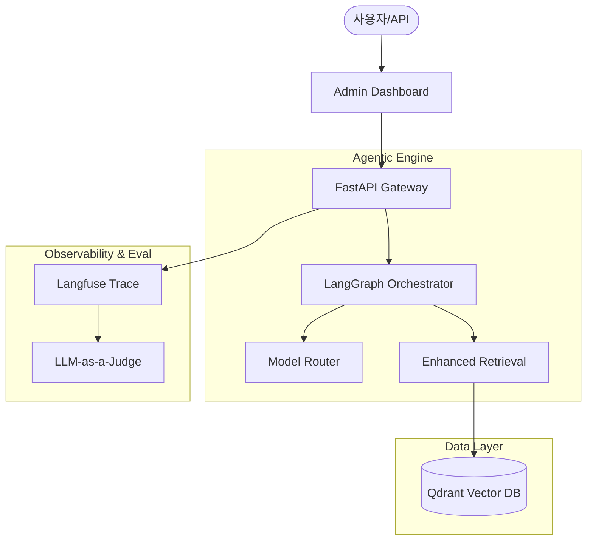

# Enterprise Agentic RAG Architecture
## 실험실을 넘어 실서비스급 RAG 플랫폼으로의 도약

---

## 1. 개요 (Introduction)

### 💡 Why Agentic RAG?
- **기본 RAG의 한계**: 질문의 복잡도가 높아지면 단순히 문서 하나만 찾아와서는 답변이 불가능함.
- **해결책**: AI가 스스로 사고(Reasoning)하고, 계획(Planning)한 뒤, 자신의 답변을 비평(Critic)하여 수정하는 **순환형 구조** 도입.

---

## 2. 전체 시스템 아키텍처 (Architecture)

---

## 3. 핵심 기술 1: 실행 제어 (LangGraph)

### 🧩 논리적 워크플로우 제어
- **Simple Mode**: `Retrieve -> Generate` (선형 구조)
- **Advanced Mode**: `Planner -> Executor -> Critic` (순환 구조)
- **State Management**: 공유된 State 객체에 검색 결과와 비평 피드백을 담아 단계별로 전달.
- **Fail-safe**: 비평 결과(Score)가 낮을 경우 최대 3회까지 자동 재시도하는 로직 구현.

---

## 4. 핵심 기술 2: 지식 주입 (RAG Enhancement)

### 🏗️ Data Engineering
- **Layout-aware Parsing**: `PDF4LLM`을 통한 마크다운 기반 파싱. 문서의 표(Table)와 제목 계층을 보존하여 검색 정확도 향상.
- **Smart Chunking**: `RecursiveCharacterTextSplitter`를 이용한 의미 단위 분할.
- **LLM Listwise Rerank**: 벡터 유사도로 상위 10개를 뽑고, **LLM이 직접 문서를 읽어** 최종 3개를 선별. (Precision 극대화)

---

## 5. 핵심 기술 3: 관측 및 통제 (Langfuse)

### 🔍 Observability 기반 운영
- **Trace/Span**: AI가 답변을 만들기 위해 거친 모든 '생각의 경로'를 트리 구조로 시각화.
- **Prompt Management**: 코드를 수정하지 않고 Langfuse UI에서 실시간으로 프롬프트 버전 관리 및 AB 테스트 가능.
- **Latency & Cost**: 각 단계별 지연 시간과 토큰 비용을 자동 계산하여 운영 최적화.

---

## 6. 핵심 기술 4: 품질 측정 (LLM-as-a-Judge)

### ⚖️ 객관적 지표 수립
- **RAGAS 기반 지표**:
    - **Faithfulness**: 답변이 검색된 문서(근거)에만 기반했는가? (환각 방지)
    - **Relevancy**: 답변이 사용자의 질문 의도에 부합하는가?
- **평가 자동화**: `Golden Set`을 활용해 배포 전 성능을 수치로 검증 (`scripts/run_eval.py`).

---

## 7. 결론 및 향후 계획 (Conclusion)

### 📈 성과 요약
- **신뢰성**: Self-Correction 루프를 통해 답변 오답률 감소.
- **운영 효율**: 관측 도구 통합으로 장애 대응 시간(MTTR) 단축.
- **플랫폼화**: 새로운 기능을 '노드' 형태로 쉽게 확장 가능한 구조.

### 🚀 Future Roadmap
- **Tool Use**: 웹 검색, 데이터베이스 조회 도구 연동.
- **Multi-modal**: 이미지 및 도표 직접 분석 기능 강화.
- **Personalization**: 사용자 피드백 기반 자동 학습 최적화.

---
**작성자**: [이름/팀명] | **작성일**: 2026.02.05
