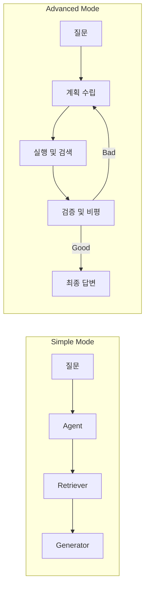
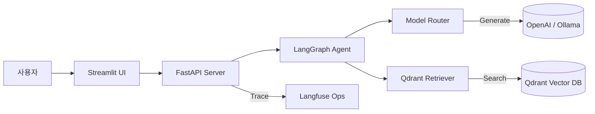

# 📘 AI 서비스 (RAG POC) 운영자 및 사용자 매뉴얼

본 문서는 AI 검색/답변 서비스(RAG POC)의 주요 기능, 사용 방법, 그리고 운영 가이드를 제공합니다.

---

## 1. 시스템 개요 (System Overview)
이 시스템은 사용자가 업로드한 문서(PDF 등)를 기반으로 질문에 답변을 제공하는 **RAG(검색 증강 생성)** 서비스입니다.
- **Frontend**: Streamlit (관리자 대시보드 및 채팅 UI)
- **Backend**: FastAPI (API 서버)
- **Engine**: LangGraph (에이전트 로직), Qdrant (벡터 검색), Langfuse (모니터링 & 평가)

---

## 2. 시작하기 (Getting Started)

### 서버 실행
터미널에서 다음 명령어를 실행하여 모든 서비스를 시작합니다.
```bash
./start_all.sh
```
> **참고**: 실행 후 약 10~20초 뒤 서비스가 완전히 로딩됩니다.

### 접속 주소
- **대시보드 (UI)**: [http://localhost:8501](http://localhost:8501)
- **Langfuse (모니터링)**: [http://localhost:3000](http://localhost:3000) (ID/PW: `user@example.com` / `password` - 설정 파일 참조)

---

## 3. 주요 기능 가이드

### 💬 1. 채팅 및 테스트 (Chat & Test)
지식 베이스에 적재된 문서를 바탕으로 AI와 대화하는 기능입니다. 이 시스템은 **LangGraph** 기반의 파이프라인으로 작동하며, 두 가지 모드를 지원합니다.

#### 🔄 에이전트 모드 (Agent Modes)
사이드바의 **"🧩 에이전트 모드"** 설정에서 선택할 수 있습니다.

1.  **⚡️ Fast RAG (기본 - Simple Mode)**
    *   **흐름**: `질문 -> 검색(Retriever) -> 답변(Generator)`
    *   **특징**: 빠르고 직관적인 답변. 일반적인 RAG.
    *   **관련 프롬프트**: `System Default`, `RAG Context`, `Task QA`

2.  **🧩 Advanced Agent (심화 - Complex Mode)**
    *   **흐름**: `질문 -> 계획(Planner) -> 실행(Executor) -> 검증(Critic) -> (필요시 수정) -> 답변`
    *   **특징**: 복잡한 질문을 논리적으로 분해하고, 답변의 사실 여부를 스스로 검증합니다.
    *   **관련 프롬프트**: 위 3개 + **`Planner`**, **`Critic`**



#### ⚙️ 검색 및 프롬프트 설정
1. **질문 입력**: 하단 채팅창에 질문을 입력하세요.
2. **검색 설정 (Retrieval Settings)**:
   - **검색 결과 수 (Top-K)**: 최종적으로 답변에 사용할 문서 개수.
   - **Reranking 적용**: 체크 시, **LLM이 직접 문서를 읽고** 가장 관련성 높은 문서를 선별합니다. (속도는 느리지만 정확도 대폭 향상)
3. **프롬프트 선택 (Prompt Selection)**:
   - 각 모드에 사용되는 프롬프트(Persona)를 개별적으로 교체하여 테스트할 수 있습니다.
4. **결과 확인**: 답변과 함께 사용된 근거(Context)와 Trace ID(로그 추적용)가 표시됩니다.

### 📥 2. 데이터 적재 (Ingest) & 관리
PDF 문서를 업로드하여 AI가 학습(검색)할 수 있도록 만듭니다.

1. **파일 업로드**: `PDF` 파일을 드래그하여 업로드합니다.
   - **주의**: 한국어/영어 혼용 문서의 레이아웃 깨짐을 방지하기 위해 **Markdown 변환 방식(`pdf4llm`)**이 적용되어 있습니다. 표나 복잡한 서식도 최대한 원본 그대로 유지됩니다.
2. **컬렉션 선택**: 데이터를 저장할 공간(Collection) 이름을 입력합니다. (기본값: `knowledge_base`)
3. **적재 실행**: 버튼을 누르면 텍스트 추출 -> 청킹(Chunking) -> 벡터 변환 -> DB 저장이 자동으로 진행됩니다.

### ✅ 3. 평가 및 Golden Set 관리 (Evaluation)
AI의 답변 품질을 지속적으로 관리하기 위한 기능입니다.

1. **Golden Set (정답지) 관리**:
   - 예상 질문(`input`)과 모범 답안 키워드(`ground_truth`)를 직접 수정하고 저장할 수 있습니다.
   - **Langfuse 동기화**: 수정한 데이터셋을 Langfuse 서버로 전송하여 버전 관리를 할 수 있습니다.
2. **평가 실행 (Run Eval)**:
   - 저장된 Golden Set을 바탕으로 현재 AI 모델의 성능을 자동 평가합니다.
   - 결과는 Langfuse 대시보드에서 점수와 함께 상세하게 확인할 수 있습니다.

---

## 4. 문제 해결 (Troubleshooting)

### Q. 질문을 했는데 답변이 이상하거나 "정보가 없다"고 합니다.
- **Top-K를 늘려보세요.** (3 -> 5~7) 관련 내용이 잘려 나갔을 수 있습니다.
- **Reranking을 켜보세요.** 관련된 문서가 더 정확하게 선택될 수 있습니다.
- 업로드한 PDF가 이미지 방식인지 확인하세요. 현재는 텍스트형 PDF에 최적화되어 있습니다.

### Q. 서버가 500 에러를 뱉습니다.
- 터미널(실행 창)의 로그를 확인하세요.
- 최근에 코드를 수정했다면 `./start_all.sh`로 서버를 재시작해 주세요.

### Q. 한글이 깨져서 나옵니다.
- 현재 시스템은 `pdf4llm` 패키지를 사용하여 **레이아웃 보존** 모드로 작동합니다.
- 만약 특정 문서에서 문제가 발생한다면, 해당 PDF의 인코딩(글꼴) 문제일 수 있습니다.

---

## 5. 시스템 아키텍처 요약

- **Router**: 복잡도에 따라 로컬 모델과 클라우드 모델을 스마트하게 분기합니다.

---

## 6. 프로젝트 구조 및 주요 활성 모듈

이 프로젝트는 유지보수성과 확장성을 위해 모듈화되어 있으며, 현재 다음 파일들이 핵심 로직을 담당하고 있습니다.

### 🎯 핵심 애플리케이션 (`/app`)
- **`agents/`**: LangGraph 기반 에이전트 로직
  - `simple_agent.py`: 기본 RAG 모드 처리
  - `advanced_agent.py`: 심화 에이전트(Planner/Critic) 처리
- **`api/`**: FastAPI 기반 백엔드 서버
  - `server.py`: 채팅, 적재, 평가 API 엔드포인트
- **`core/`**: 시스템 핵심 설정 및 프롬프트 관리
  - `config.py`: 환경 변수 및 글로벌 설정
  - `prompts.py`: Langfuse 연동 및 프롬프트 버전 관리
- **`models/`**: LLM 호출 인터페이스
  - `router.py`: 모델 호출 전략 및 분기
- **`ops/`**: 모니터링 및 성능 평가
  - `monitor.py`: 실시간 트레이싱 (Langfuse)
  - `evaluator.py`: 답변 품질 검증 및 점수 산정
- **`rag/`**: 검색 및 데이터 처리
  - `retriever.py`: Qdrant 검색, 임베딩, 문서 청킹 통합 관리
- **`ui/`**: Streamlit 기반 대시보드
  - `streamlit_app.py`: 통합 관리 화면 및 채팅 UI

### 📜 주요 스크립트 (`/scripts`)
- `run_eval.py`: 자동 성능 평가 실행 엔진
- `seed_prompts.py`: 초기 필수 프롬프트 자동 등록 도구

---
**작성일**: 2026.02.04 | **버전**: v1.2.0
